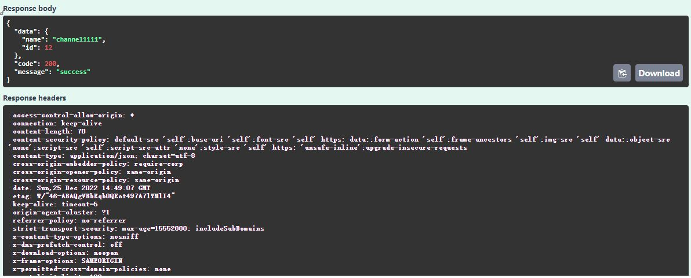
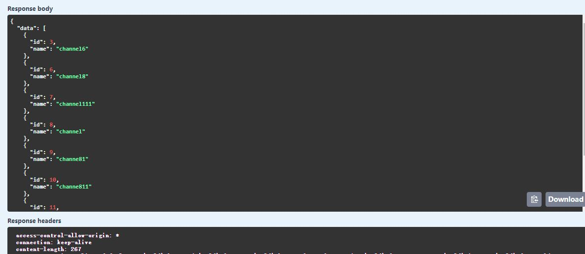
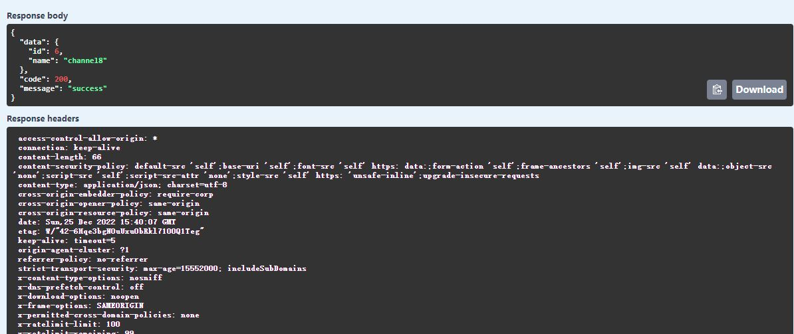
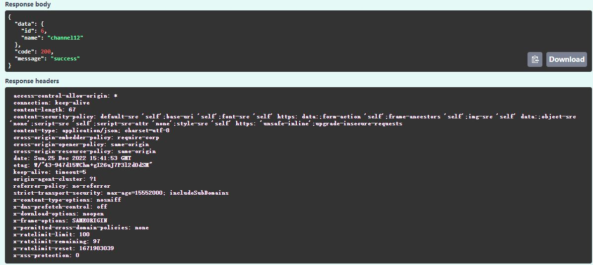
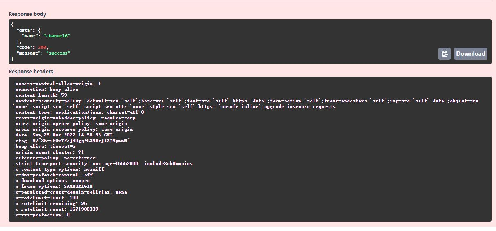
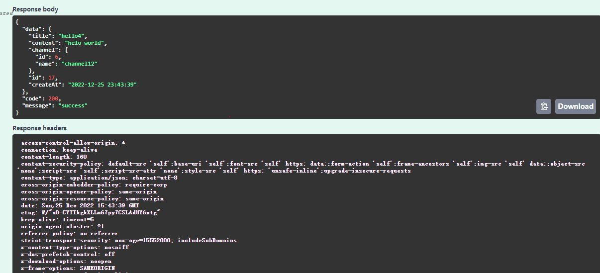
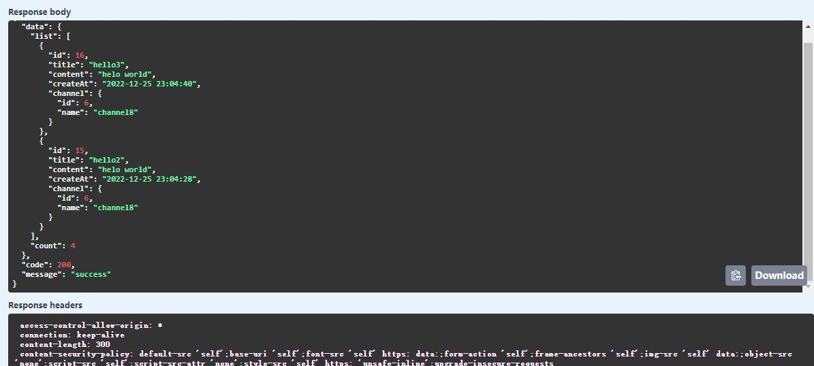
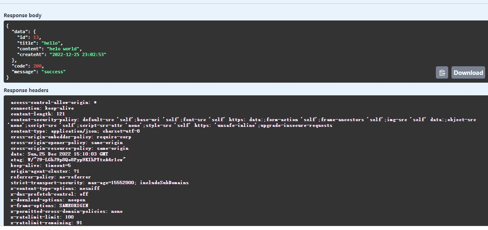
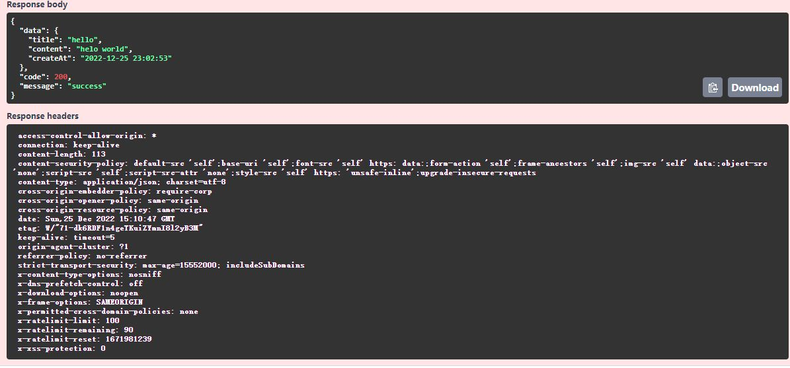

# 构建一个简单的频道<->消息应用 API 接口

## 技术栈

- nestjs - 一个使用 typescript 构建的企业级 node.js 框架
- typeorm - 一个 node+ts 构建的 orm
- class-validator - 用于验证 ts 类
- class-transform - 用于序列化 ts 对象
- helmet -header 对增加安全性
- express-rate-limit -可以显示每分钟单个 IP 的请求次数，防止恶意攻击
- mysql- 关系数据库

## 数据库创建命令

```shell
 create database forum default character set utf8mb4 collate utf8mb4_bin;
```

## API 接口设计

**响应数据格式**

```shell
 {
  "data":{

  },
  "code":200||801,
  "message":"success"||"The channel name already exists"
 }

```

**自定义状态规则**
| 状态码 | 消息 |
| ---- | ---- |
| 200 | success|
| 801 | The channel name already exists|
| 802 | The channel id:${id} doesn't exists|
| 803 | The message title:${title} already exists|
| 804 | The message id:${id} doesn't exist|

**频道接口设计**

创建频道

- url: /api/channel
- method: POST
- request:

```shell
{"name": "channel"}
```

- response:

```shell
  {
  "data": {
  "name": "channel",
  "id": 1
  },
  "code": 200,
  "message": "success"
  }
```

获得所有频道

- url: /api/channel
- method: GET
- request: 无
- response:

```shell
{
  "data": [
  {
  "id": 3,
  "name": "channel6"
  },
  {
  "id": 6,
  "name": "channel8"
  },
  ],
  "code": 200,
  "message": "success"
  }
```

获得一个频道

- url: /api/channel/:id
- method: GET
- request: 无
- response:

```shell
{
  "data": {
  "name": "channel",
  "id": 1
  },
  "code": 200,
  "message": "success"
  }
```

更新一个频道

- url: /api/channel/:id
- method: PATCH
- request:

```shell
{"name": "channel1"}
```

- response:

```shell
 {
  "data": {
  "name": "channel1",
  "id": 1
  },
  "code": 200,
  "message": "success"
  }
```

删除一个频道

- url: /api/channel/:id
- method: DELETE
- request: 无
- response:

```shell
{
  "data": {
  "name": "channel",
  },
  "code": 200,
  "message": "success"
  }
```

**消息接口设计**

创建消息

- url: /api/message
- method: POST
- request :

```shell
{
  "title": "hello",
  "content": "hello world",
  "channel": 1
  }
```

response:

```shell
 {
 "data": {
 "title": "hello",
 "content": "helo world",
 "channel": {
 "id": 6,
 "name": "channel8"
 },
 "id": 13,
 "createAt": "2022-12-25 23:02:53"
 },
 "code": 200,
 "message": "success"
 }
```

获得某个频道的所有消息

- url: /api/message?pageNum=1&pageSize=2&channel=1
- method: GET
- request: 无
- response:

```shell
  {
  "data": {
  "list": [
  {
  "id": 16,
  "title": "hello3",
  "content": "helo world",
  "createAt": "2022-12-25 23:04:40",
  "channel": {
  "id": 6,
  "name": "channel8"
  }
  },
  {
  "id": 15,
  "title": "hello2",
  "content": "helo world",
  "createAt": "2022-12-25 23:04:28",
  "channel": {
  "id": 6,
  "name": "channel8"
  }
  }
  ],
  "count": 4
  },
  "code": 200,
  "message": "success"
```

获得一条消息

- url: /api/message/:id
- method: GET
- request: 无
- response:

```shell
{
  "data": {
  "id": 13,
  "title": "hello",
  "content": "helo world",
  "createAt": "2022-12-25 23:02:53"
  },
  "code": 200,
  "message": "success"
  }
```

删除一条消息

- url: /api/message/:id
- method: DELETE
- request: 无
- response:

```shell
{
  "data": {
  "title": "hello",
  "content": "helo world",
  "createAt": "2022-12-25 23:02:53"
  },
  "code": 200,
  "message": "success"
  }
```

## 开发

### 安装启动

下载源码

```shell
git clone https://github.com/xucandy/forum
```

安装应用

```shell
cd forum && npm install
```

启动应用并热更新

```shell
npm run start:dev
```

### IDE 配置

推荐使用 Vscode 配置开发环境

为了能身心愉悦的编辑代码，请使用以下命令安装 eslint 与 prettier 插件

```shell
code --install-extension dbaeumer.vscode-eslint \
  && code esbenp.prettier-vscode
```

## 编码

### 文件结构

```shell
src
├── app.controller.spec.ts                    #框架默认文件
├── app.controller.ts                         #框架默认文件
├── app.module.ts                             #框架默认文件
├── app.service.ts                            #框架默认文件
├── config
│   └── database.config.ts                    #数据库配置文件
├── common
│   └── fliter
│   │      └──http-exception.filter.ts        #异常过滤类
│   └── interceptor
|            └──response.interceptor..ts       #响应拦截类
├── main.ts                                   #应用的启动引导文件
├── channel                                   #频道模块
│   ├── dto                                   #请求数据验证DTO
│   ├── entities                              #实体模型
│   ├── channel.controller.ts                 #频道控制器类
│   ├── channel.module.ts                     #频道模块
│   ├── channel.service.ts                    #频道服务类
│   ├── channel.service.spec.ts               #频道服务测试类
│
├── message                                   #消息
    ├── dto                                   #请求数据验证DTO
    ├── entities                              #实体模型
    ├── message.controller.ts                 #消息控制器类
    ├── message.module.ts                     #消息模块类
    ├── message.service.ts                    #消息服务类
    ├── message.service.spec.ts               #消息测试类
```

### 新增模块

一，新增一个 channel 模块，通过命令行创建 nest g res channel

二，新增一个 message 模块,通过命令行创建 nest g res message

### 新增过滤器和拦截器

一，新增一个 异常过滤器，通过命令行创建 nest g --no-flat http-exception common/filter

二，新增一个 拦截器 ,通过命令行创建 nest g --no-flat response common/interceptor

相关具体实现细节请看源代码。

### 测试接口

**有四种方法**

- postman 测试
- vscode 的 REST Client 插件接口测试
  测试文件：api-test.http
- swagger 测试 http://localhost:3000/forum-docs
- 自动化测试 TDD,E2E 编码测试。

本项目已通过 Swagger 和 rest client 两种接口测试

**频道接口测试**

创建频道

- url: /api/channel
- method: POST
- request: {"name": "channel1111"}
- response:
  

获得所有频道

- url: /api/channel
- method: GET
- request: 无
- response:
  

  获得一个频道

- url: /api/channel/8
- method: GET
- request: 无
- response:
  

  更新一个频道

- url: /api/channel/6
- method: PATCH
- request: {"name": "channel12"}
- response:
  

删除一个频道

- url: /api/channel/6
- method: DELETE
- request: 无
- response:
  

**消息接口测试**

创建消息

- url: /api/message
- method: POST
- request : {
  "title": "hello",
  "content": "hello world",
  "channel": 6
  }
- response:
  

获得某个频道的所有消息

- url: /api/message?pageNum=6&pageSize=2&channel=1
- method: GET
- request: 无
- response:
  

获得一条消息

- url: /api/message/:id
- method: GET
- request: 无
- response:
  

删除一条消息

- url: /api/message/2
- method: DELETE
- request: 无
- response:
  

### 自动化测试

TDD 测试编写请参考`src/channel/channel.controller.spec.ts`

E2E 测试编写请参考`test/channel.e2e-spec.ts`

**运行测试命令**

- TDD: `npm run test:watch`,
- E2E: `npm run  test:e2e:dev`

## 部署

**部署三种方式**

- github+action
- github+drone
- docker 部署

使用 github+action 的 devops 方式进行部署，步骤如下
在服务器中

- 安装 node
- 安装 nginx，并配置 nginx
- 安装 pm2
- 使用 ​​ssh-keygen -t rsa，​ 生成 ​id_rsa​​​ 和 ​​id_rsa.pub​​ 两个文件
- 在 github 项目中【​​Settings​​​】-【​​Secrets​​​】中添加 ​​REMOTE_HOST​​​（服务器 ​​IP​​​）、​ ​REMOTE_USERNAME​​​ （服务器用户名）和 ​​PRIVATE_KEY​​​ （​​id_rsa​​​ 文件内容）
- 编写流程脚本
  在项目根目录下新建 ​​.github/workflows/github.yml​​ 文件如下：

```shell
# workflow名称
name: build-and-deploy-nextjs
# 对应第1步，master代码变动执行该workflow
on:
  push:
    branches:
      - master
jobs:
  build-and-deploy:
    # 定义job运行环境，使用linux环境
    runs-on: ubuntu-latest
    steps:
    # 对应第2步，借助已有脚本拉取代码
    - name: Checkout
      uses: actions/checkout@master

    # 第3步的准备工作，先配置好node环境
    - uses: actions/setup-node@v2
      with:
        node-version: '14'
    # 对应第3步，执行打包命令
    - name: 'Build'
      run: |
        npm i
        npm run build

    # 对应第4、5步，配置参数登陆服务器+拷贝到指定目录
    - name: Upload
      uses: appleboy/scp-action@master
      with:
        host: ${{ secrets.REMOTE_HOST }}
        username: ${{ secrets.REMOTE_USERNAME }}
        key: ${{ secrets.PRIVATE_KEY }}
        # 拷贝 .next、public文件夹和package.json文件到服务器指定目录
        source: ".next/,public/,package.json"
        target: "/nextjs-demo"

    # 对应第6步，重启安装依赖、后端服务2
    - name: Server Reload
      uses: appleboy/ssh-action@master
      with:
        host: ${{ secrets.REMOTE_HOST }}
        username: ${{ secrets.REMOTE_USERNAME }}
        key: ${{ secrets.PRIVATE_KEY }}
        script: |
          cd /nextjs-demo
          npm i
          pm2 reload nextjs-dem
-----------------------------------
```

- deploy_path: 生产服务器需要部署的路径
- host: 生产服务器的 IP 地址
- key: 构建服务器连接生成服务器用到的密匙(需要提前将公钥添加到生产服务器的`authorized_key`中)
- username: 连接生产服务器的用户名

更简洁的方式

可以自行配置一个 Dockerfile 或者 docker-compose.yml 代替 pm2+nginx.

**注意**

与 ​​pm2​​​ 部署方式不同的是，打包生成的 ​​docker​​​ 镜像一般不会直接上传到服务器，而是上传到 ​​docker​​​ 仓库，部署的时候再从 ​​docker​​​ 仓库下载到服务器。
